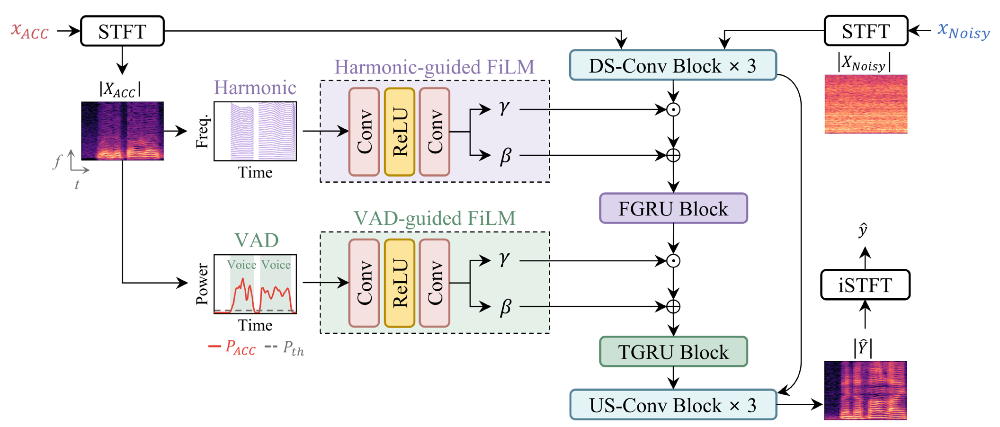

# LAU-NetV2 🚀  
**Official PyTorch Implementation**

This repository provides the official implementation of:

**Real-Time Speech Enhancement on Edge Devices Using Harmonic and Voice-Activity Cues from a Skin-Attachable Accelerometer**  
*(Paper accepted at Interspeech 2026)*

---

<p align="center">
  
</p>

---

## 🔎 Overview

LAU-NetV2 is a lightweight multimodal speech enhancement model designed for low-resource and on-device deployment.

It leverages:

- 🎤 Noisy Air Microphone (AM)
- 📎 Neck-worn Accelerometer (ACC)
- 🎵 Harmonic cue extracted from ACC
- 🗣 VAD cue extracted from ACC

Harmonic and VAD cues are integrated via FiLM-guided FGRU and TGRU blocks inside a compact U-Net backbone.

---

## 🧠 Model Input

The model expects a **4-channel input**:

```
[ noisy AM, ACC, harmonic mask, VAD mask ]
```

Tensor shape:

```
[B, 4, F, T]
```

Where:
- `B` = batch size  
- `F` = frequency bins  
- `T` = time frames  

---

## 📂 Repository Structure

```
model.py                → LAU-NetV2 architecture
train.py                → Training script
test.py                 → Evaluation script
dataset.py              → Dataset loader
preprocessing.py        → Spectrogram preprocessing
harmonic_vad_mask.py    → Harmonic & VAD mask generation
metric_helper.py        → PESQ / STOI computation
compute_metric.py       → Evaluation utilities
```

---

## 📊 Required Datasets

### 1️⃣ TAPS Dataset  
Throat and Acoustic Pairing Speech Dataset

- HuggingFace:  
  https://huggingface.co/datasets/yskim3271/Throat_and_Acoustic_Pairing_Speech_Dataset  

- Zenodo:  
  https://zenodo.org/records/18324208  

Both provide identical data in different formats.

---

### 2️⃣ DNS Challenge Noise Dataset

https://github.com/microsoft/DNS-Challenge  

Noise is added **only to the AM** during training.

---

## ⚙️ Preprocessing Pipeline

### Step 1 — Generate Segmented Spectrograms

```bash
python preprocessing.py
```

### Step 2 — Generate Harmonic & VAD Masks

```bash
python harmonic_vad_mask.py --split all
```

This generates:

```
harmonic_masks_{train,val,test}.npy
vad_masks_{train,val,test}.npy
```

---

## 🏋️ Training

```bash
python train.py
```

---

## 🧪 Evaluation

```bash
python test.py
```

Evaluation metrics include:

- PESQ
- STOI

---
